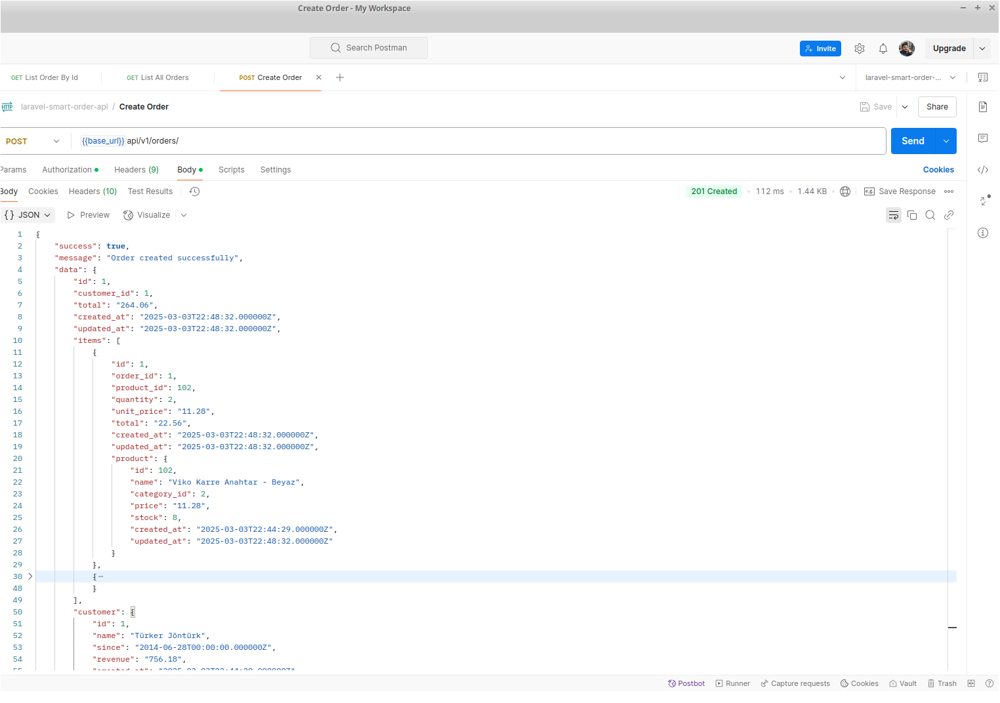
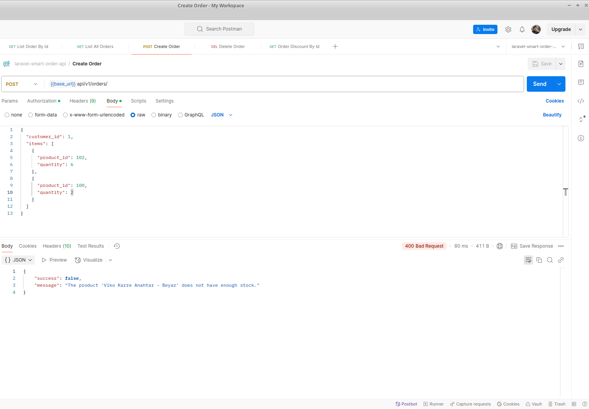
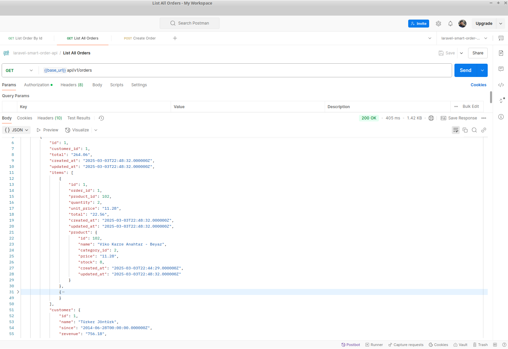
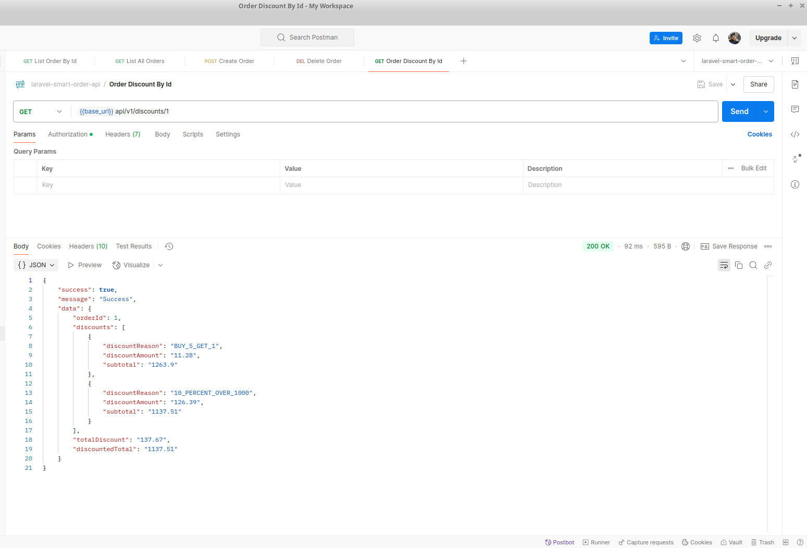

# Laravel Smart Order API

An order management and discount calculation API built with **Laravel 10**. This project enables businesses to manage orders with a flexible discount system using SOLID principles, service-oriented architecture, and design patterns for clean, maintainable code.

---

## Features

- **Versioning**:
    - The API follows versioning conventions (/v1/) for backward compatibility and future updates.

- **Order Management**:
    - Create new orders with customer information and product items
    - List all orders with detailed information
    - View specific order details
    - Delete orders
    - Stock validation to prevent ordering unavailable products

- **Smart Discount System**:
    - Implements the Strategy pattern for flexible discount rules
    - Calculates discounts based on various conditions:
        - Percentage discount on orders above a certain amount
        - Buy X Get Y Free for products in specific categories
        - Percentage discount on the cheapest product when buying multiple products from a specific category
    - Easily extendable architecture for additional discount rules

- **Clean Architecture**:
    - Repository pattern for data access
    - Service layer for business logic
    - SOLID principles implementation
    - Standardized API responses

- **Validation**:
    - Robust input validation for all requests
    - Meaningful error messages

- **Docker Support**:
    - Containerized environment for easy setup and deployment
    - Multi-container configuration with Docker Compose
    - Separate containers for Laravel app, MySQL, and Nginx
    - Ready for local development and production

- **Postman Collection & Environment**:
    - Predefined Postman collection and environment files available in resources/docs/postman/ for quick API testing

---

## Technologies Used

- **Backend**: Laravel 10 (PHP 8.2+)
- **Database**: MySQL 8.0
- **ORM**: Eloquent ORM
- **API Design**: RESTful API with versioning (/v1/)
- **Validation**: Laravel Request Validation
- **Design Patterns**: Repository, Service, Strategy patterns
- **Documentation**: Postman collection and environment
- **Containerization**: Docker, Docker Compose
- **Web Server**: Nginx

---

## Project Architecture

- **API Response Structure**: Standardized responses using `ApiResponse` trait for consistent success & error handling
- **Service Layer**: Business logic contained in `App\Services` (e.g., `OrderService`, `DiscountService`)
- **Repository Layer**: Data access through `App\Repositories` interfaces and implementations
- **Strategy Pattern**: Discount rules implemented as strategies in `App\Services\Discounts\Strategies`
- **Exception Handling**: Centralized exception handling in `App\Exceptions\Handler.php`
- **Middleware**: Custom middleware for request/response handling
- **Docker Infrastructure**: Multi-container setup for application, database, and web server

---

## Project Structure

The project follows a layered architecture with clear separation of concerns:

- **Models**: Represent database entities with relationships
- **Repositories**: Handle data access and persistence
- **Services**: Contain business logic and orchestrate operations
- **Controllers**: Handle HTTP requests and responses
- **Requests**: Validate incoming data
- **Discount Strategies**: Encapsulate discount calculation logic
- **Docker Configuration**:
    - docker-compose.yml: Define multi-container Docker application
    - Dockerfile: PHP 8.2 configuration for Laravel
    - nginx/default.conf: Nginx web server configuration
- **Documentation**:
    - Postman collection: resources/docs/postman/laravel-smart-order-api.postman_collection.json
    - Postman environment: resources/docs/postman/laravel-smart-order-api.postman_environment.json
    - Example data: resources/docs/example-data/

---

## API Endpoints

### Orders
- **GET /api/v1/orders**: List all orders
- **GET /api/v1/orders/{id}**: Get details of a specific order
- **POST /api/v1/orders**: Create a new order
- **DELETE /api/v1/orders/{id}**: Delete an order

### Discounts
- **GET /api/v1/discounts/{orderId}**: Calculate discounts for a specific order

---

## Setup & Installation

### Prerequisites

- Docker and Docker Compose installed on your system
- Git

### Step 1: Clone the Repository

```bash
git clone https://github.com/your-username/laravel-smart-order-api.git
cd laravel-smart-order-api
```

### Step 2: Configure Environment Variables

Copy the `.env.example` file to `.env`:

```bash
cp .env.example .env
```

Configure the following environment variables in your `.env` file:

```bash
APP_KEY=base64:your-app-key
DB_HOST=db
DB_DATABASE=smart_order
DB_USERNAME=smart_order_user
DB_PASSWORD=your_password
DB_ROOT_PASSWORD=your_root_password
```

### Step 3: Start Docker Containers

```bash
docker-compose up -d
```

This will start three containers:
- Laravel application (PHP 8.2)
- MySQL 8.0 database
- Nginx web server

### Step 4: Install Dependencies and Set Up Laravel

```bash
# Enter the app container
docker-compose exec app bash

# Inside the container, run:
composer install
php artisan key:generate
php artisan migrate --seed
```

The API will be available at `http://localhost:8001/api/v1/`.

---

## Docker Configuration Details

The project includes the following Docker configuration:

### 1. Docker Compose Setup (docker-compose.yml)

The `docker-compose.yml` file defines three services:
- **app**: The Laravel application container (PHP 8.2)
- **db**: MySQL 8.0 database container
- **webserver**: Nginx web server container

### 2. Laravel Application (Dockerfile)

The `Dockerfile` sets up the PHP environment for Laravel:
- PHP 8.2 with FPM
- Required PHP extensions for Laravel
- Composer for dependency management
- Appropriate file permissions for Laravel storage and caches

### 3. Web Server (nginx/default.conf)

The `nginx/default.conf` file configures Nginx to:
- Serve the Laravel application from `/var/www/public`
- Route requests to the PHP-FPM process in the app container
- Handle pretty URLs for the Laravel router

### 4. Container Management

Common Docker commands for managing the application:

```bash
# Start all containers in detached mode
docker-compose up -d

# View logs from all containers
docker-compose logs

# View logs from a specific container
docker-compose logs app

# Stop all containers
docker-compose stop

# Stop and remove all containers, networks, and volumes
docker-compose down

# Rebuild containers after Dockerfile changes
docker-compose up -d --build
```

---

## API Usage Examples

### Create a New Order

**Request:**
```bash
POST /api/v1/orders
```

**Body:**
```json
{
  "customer_id": 1,
  "items": [
    {
      "product_id": 102,
      "quantity": 10
    },
    {
      "product_id": 100,
      "quantity": 2
    }
  ]
}
```

### Calculate Discounts for an Order

**Request:**
```bash
GET /api/v1/discounts/3
```

**Response:**
```json
{
  "success": true,
  "message": "Success",
  "data": {
    "orderId": 3,
    "discounts": [
      {
        "discountReason": "BUY_5_GET_1",
        "discountAmount": "11.28",
        "subtotal": "1263.90"
      },
      {
        "discountReason": "10_PERCENT_OVER_1000",
        "discountAmount": "127.51",
        "subtotal": "1136.39"
      }
    ],
    "totalDiscount": "138.79",
    "discountedTotal": "1136.39"
  }
}
```

---

## Postman Collection

The project includes a complete Postman collection and environment for testing all API endpoints. You can find these files in:

- Collection: `resources/docs/postman/laravel-smart-order-api.postman_collection.json`
- Environment: `resources/docs/postman/laravel-smart-order-api.postman_environment.json`

Import these files into Postman to quickly test the API.

---

## API Screenshots

Below are screenshots of the API in action, demonstrating the key functionality:

### Order Management

#### Creating a New Order

*Screenshot showing the creation of a new order with product items*

#### Order Validation - Out of Stock

*Screenshot showing validation when trying to order products that are out of stock*

#### Listing All Orders

*Screenshot showing the retrieval of all orders with their details*

### Discount Calculation

#### Category-Based Buy 5 Get 1 Free Discount

*Screenshot showing the discount applied when buying 6 items from a specific category*

#### Order Total Over 1000 + Category Discount

*Screenshot showing multiple discount strategies applied together: 10% off for orders over 1000 TL and Buy 5 Get 1 Free*

---

## Architecture Details

### Discount Strategy Implementation

The project uses the Strategy pattern to implement various discount rules:

1. **TotalAmountDiscount**: Percentage discount on orders above a certain amount
2. **CategoryQuantityDiscount**: Buy X Get Y Free for products in specific categories
3. **CategoryMultipleItemsDiscount**: Percentage discount on the cheapest product when buying multiple items from a specific category

New discount strategies can be easily added by:
1. Creating a new class that implements `DiscountStrategyInterface`
2. Implementing the `apply()` and `getReason()` methods
3. Registering the strategy in `AppServiceProvider`

---

## Why This Project?

This project demonstrates my approach to building maintainable and extensible APIs using Laravel. It showcases:

- Implementation of design patterns like Strategy, Repository, and Service
- SOLID principles in action
- Clean code practices
- Thoughtful API design
- Flexible architecture that allows for easy extension
- Modern deployment approach with Docker

---

## Future Enhancements

Potential enhancements for future versions:
- Authentication and authorization
- Custom discount rules per customer or customer group
- Product and category management endpoints
- Performance optimizations for discount calculations
- More sophisticated order management features
- Reporting and analytics
- Integration with payment gateways
- CI/CD pipeline integration
- Kubernetes deployment configurations

---

## Contact

- Website: [www.ferzendervarli.com](https://www.ferzendervarli.com/)
- GitHub: [github.com/fvarli](https://github.com/fvarli)
- LinkedIn: [linkedin.com/in/fvarli](https://www.linkedin.com/in/fvarli)
